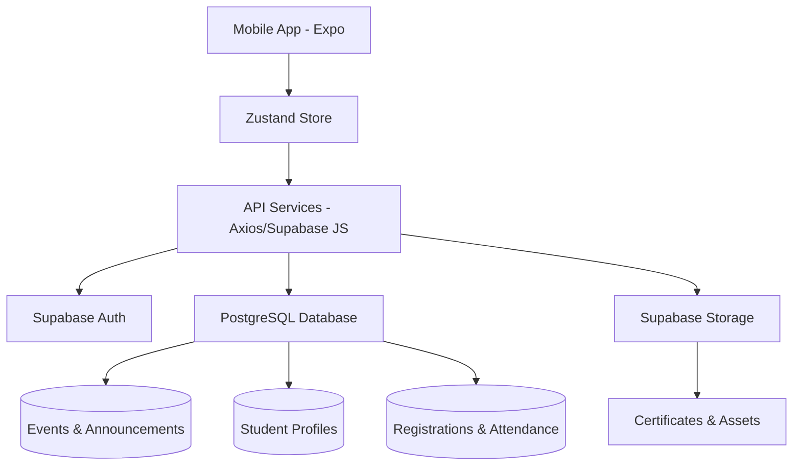

# 🎓 Campus Event App

[](https://reactnative.dev/)
[](https://expo.dev/) 
[](https://supabase.com/)
[](https://github.com/pmndrs/zustand)
[](https://www.typescriptlang.org/)

**Campus Event App** is a state-of-the-art, production-ready mobile ecosystem designed to bridge the gap between college event organizers and students. Built with a "Mobile-First" philosophy, it streamlines event discovery, registration, and attendance management using modern cloud infrastructure.

---

## 📱 Download Application

Get the latest version of the app for your Android device:

| **Direct Download** | **Scan to Download (QR)** |
| :--- | :--- |
| [📥 Download APK (v1.0.0)](https://expo.dev/accounts/pratikbavche/projects/campus-event-app/builds/fd502b74-70ca-405e-ae9c-2f80d25e77ea) |  |

---
 
## 🚀 Vision & Problem Solving

### The Real-World Problem
Traditionally, college events suffer from fragmented information, manual paper-based registrations, and delayed certificate distribution. Students miss opportunities because of poor notification systems, and organizers struggle with attendance tracking and data management.

### Our Solution
1.  **Centralized Discovery**: All campus events (Technical, Cultural, Sports) in one unified dashboard.
2.  **Frictionless Registration**: Register individually or form teams in seconds.
3.  **Automated Attendance**: High-speed QR-based attendance marking to eliminate proxy entries.
4.  **Instant Gratification**: Automated feedback loops and instant access to digital certificates.
5.  **Data-Driven Insights**: Real-time stats for organizers to monitor event popularity and engagement.

---

## 🛠 Tech Stack

| Layer | Technology | Purpose |
| :--- | :--- | :--- |
| **Frontend** | **React Native + Expo** | Cross-platform mobile performance and rapid development. |
| **Language** | **TypeScript** | Type-safety and enterprise-grade maintainability. |
| **State** | **Zustand** | Lightweight, blazing-fast reactive state management. |
| **Backend** | **Supabase (PostgreSQL)** | Real-time database, authentication, and Row-Level Security (RLS). |
| **Storage** | **Supabase Storage** | Secure hosting for avatars, event posters, and digital certificates. |
| **Icons** | **Lucide React Native** | Consistent, beautiful, and searchable iconography. |
| **Animations**| **React Native Reanimated**| Premium micro-animations and smooth transitions. |
| **Navigation**| **Expo Router** | Type-safe, file-based routing for mobile. |

---

## ✨ Key Functionality

### 📱 For Students
*   **Smart Discovery**: Filter events by category (Technical, Sports, Cultural) or timeline (Today, This Week).
*   **Live Announcements**: Pinned and auto-scrolling news feed for critical updates.
*   **Universal Registration**: Support for individual entries and complex team configurations (Join/Create via codes).
*   **Digital Vault**: Access all your earned certificates in a dedicated profile section.
*   **QR Scanner**: Built-in scanner to mark attendance at venue entry points.
*   **Feedback & Rating**: Direct voice to the organizers after event completion.

### 🏛 For Organizers (via Backend/Admin)
*   **Dynamic Event Control**: Manage posters, rules, venues, and registration deadlines.
*   **Attendance Tracking**: Exportable attendance lists with precise timestamps.
*   **Certificate Deployment**: Directly link generated certificates to student roll numbers.
*   **Notification Engine**: Send targeted alerts to registered participants.

---

## 🤖 AI & Language Model Integration

This project is architected to be **AI-Native**. We are currently integrating advanced NLP and LLM features:

1.  **AI Career Assistant**: Utilizing LLMs (like Gemini/GPT) to match a student's event participation history with potential job opportunities and freelancing gigs.
2.  **Smart Resume Builder**: Automated generation of industry-standard resumes by extracting skills from earned certifications.
3.  **Multilingual Support**: Real-time localization into **Hindi**, **Marathi**, and other regional languages using AI translation models to ensure inclusivity for all students.
4.  **Content Moderation**: AI-driven screening for event descriptions and feedback to maintain a professional environment.

---

## 💼 Freelancing & Professional Impact

**Campus Event App** is more than a college project—it's a **White-Label Solution** ready for the market.

*   **Portfolio Power**: Demonstrates proficiency in full-stack mobile development, cloud integration (Supabase), and UX design.
*   **Business Opportunity**: The architecture can be adapted as a SaaS product for:
    - Corporate event management companies.
    - Workshop and training institutes.
    - High-density seminar organizers.
*   **Developer Skills**: Mastery over Expo's EAS (Expo Application Services), complex relational database schemas, and premium UI/UX implementations.

---

## 📊 Infrastructure Architecture



---

## 📥 Getting Started

### Prerequisites
*   Node.js (v18+)
*   npm or yarn
*   Expo Go app on your physical device

### Installation
1.  **Clone the Repository**
    ```bash
    git clone https://github.com/Pratik-Bavche/Campus_Event_App.git
    cd Campus_Event_App/App
    ```

2.  **Install Dependencies**
    ```bash
    npm install
    ```

3.  **Environment Setup**
    Create a `.env` file in the root:
    ```env
    EXPO_PUBLIC_SUPABASE_URL=your_supabase_url
    EXPO_PUBLIC_SUPABASE_ANON_KEY=your_supabase_anon_key
    ```

4.  **Run the App**
    ```bash
    npx expo start
    ```

---

## 🤝 Contributing
Contributions are welcome! Whether it's adding a new feature, fixing a bug, or improving documentation, feel free to open a Pull Request.

---

## 📄 License
This project is licensed under the MIT License - see the [LICENSE](LICENSE) file for details.

---
*Developed by Pratiik*
